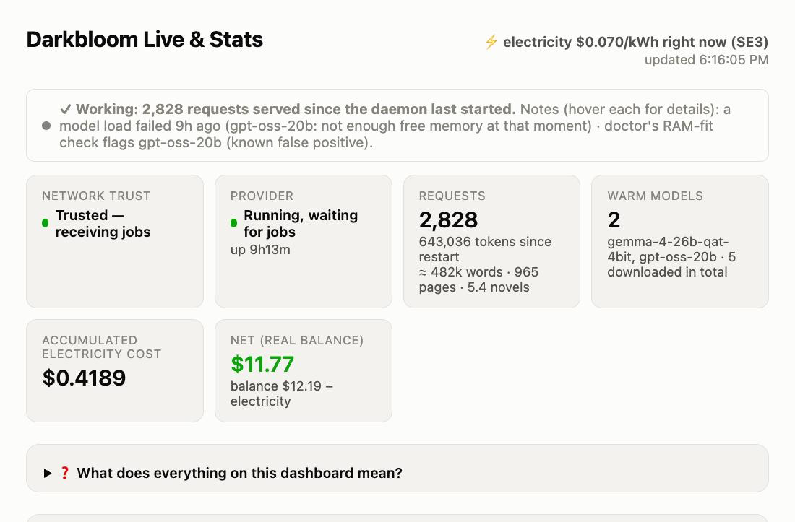

# Darkbloom Live & Stats

A local dashboard + background services for a [Darkbloom](https://darkbloom.dev)
provider Mac: live CPU/GPU/RAM/fan/temp gauges, disk usage for downloaded
models, electricity-cost vs. revenue tracking (including a real-time
electricity price forecast with a profitability overlay), automatic
multi-model warmup, trust-drop alerts, and a real-vs-estimated payout
comparison pulled directly from Darkbloom's own account API - no browser
step, no bookmarklet, just the same local device token `darkbloom login`
already stores on this Mac.

**Not affiliated with or endorsed by Darkbloom, Eigen Labs, or EigenLayer.**
Community tool, use at your own risk. It only reads local system state and
your own Darkbloom account data - it does not modify your provider's behavior.

**Works anywhere.** Electricity prices come from free, key-less public APIs
you pick in the dashboard itself: Sweden and Norway (Nord Pool day-ahead),
every European bidding zone (Energy-Charts / EPEX), UK Octopus Agile, US
ComEd hourly pricing, or a flat rate in any currency. Defaults to Sweden
(SE3) because that's where it was built - change it once in the Electricity
Price panel and every cost number on the page follows. See
[Electricity price](#electricity-price).

**New to running a provider?** The dashboard's top banners are graded: grey
means "a check flagged something but requests are succeeding, no rush",
yellow means "something is actually off, here's what to check", red means
"a model failed to load in the last two minutes". Open the
"❓ What does everything on this dashboard mean?" section on the page itself
for a walkthrough of every panel - including the one economic fact that
surprises most newcomers (most of your income comes from being online and
trusted, not from serving).




## What it looks like

A single-page dashboard at `http://127.0.0.1:8787`, only reachable from the
machine it runs on:

- **Status cards** - trust level, daemon state (idle vs. actively serving),
  requests served, warm models, accumulated electricity cost, net (real
  balance or estimate)
- **Darkbloom account** - real jobs/tokens/payout per model, polled directly
  from Darkbloom's own earnings API every 30s using the local device token
  `darkbloom login` already stores (`~/.darkbloom/auth_token`) - no browser
  step. Compared against a naive flat per-token estimate, recalibrated from
  your own real ledger data, labeled "Darkbloom gap" (**not** an official
  platform fee - just the gap between that local guess and reality)
- **Nerdy Stats** - average prompt/completion token length, GPU memory
  active/cached, per-slot KV-backend state, `darkbloom doctor` health checks,
  and a genuinely local "active vs. floor pay rate" comparison ($/hour while
  actively serving vs. $/hour on the base-reward floor, both derived from
  real local tracking, no advertised pricing involved)
- **Multi-model warmup** - keeps *every* model your provider is configured to
  serve warm (not just the first one), pinging each on an interval you set
- **Disk usage** - downloaded models and their sizes, with a one-click "copy
  remove command" for anything not currently active (never deletes for you)
- **Live gauges** - CPU / GPU / Total watts (with an estimated non-SoC
  baseline added in) / RAM used / Fan speed / GPU temp / recent utilization,
  updating at ~5Hz (matching powermetrics' own sampling rate)
- **Trust-drop alerts** - a native macOS notification plus an in-page banner
  the moment trust drops below hardware-level, even if the tab isn't open
- **Running-hot alert** - flags when the GPU is hot but the fan is barely
  spinning, i.e. Darkbloom's own fan-control helper isn't engaging (seen in
  the wild: 100°C+ at 20% fan with the helper reporting "did not enter
  manual mode"). Explains it's a performance cost, not a safety issue, and
  what to check
- **Ollama indicator** - flags when Ollama has a model loaded, since that's a
  common cause of memory contention with the Darkbloom provider on the same
  machine
- **History charts** - power over time, cumulative electricity cost vs.
  estimated revenue, with an expandable explainer for exactly how the kWh
  price and net figure are calculated
- **Electricity Price & Profitability** - real prices per kWh from the
  source you pick (see [Electricity price](#electricity-price)), shown both
  backward (yesterday, always real) and forward (today + tomorrow once the
  day-ahead auction publishes, never guessed), with an optional grid-fee/
  energy-tax/VAT line and a real Net (earnings minus this Mac's own measured
  electricity cost) overlay per 15-minute slot - see at a glance which hours
  were actually profitable, all currency-converted to USD throughout
- **Real earnings vs. cost, last 48h** - every ledger entry Darkbloom paid
  (including the base reward for being online) added up against measured
  electricity cost. The one chart that lines up with your real balance
- **Real whole-system power** - with [`macmon`](https://github.com/vladkens/macmon)
  installed, cost tracking uses the Mac's own SMC system-power sensor (RAM,
  SSD, fans included) instead of CPU+GPU plus a guess. Measured on an M4 Pro
  Mac mini, the guess was roughly 2.5x too low under sustained inference
  (SMC ~60W vs. CPU+GPU+RAM rails ~29W, nothing plugged into the ports)

## Prerequisites

- macOS, Apple Silicon, with [Darkbloom](https://darkbloom.dev) already
  installed and enrolled (`~/.darkbloom/bin/darkbloom` should exist and
  `darkbloom status` should work)
- `python3`, `bc`, `jq`, `curl` - all present on a stock macOS install except
  `jq`, which you may need to install (`brew install jq`)
- Optional but recommended: `macmon` (`brew install macmon`) for real
  whole-system power readings. Without it, power is CPU+GPU from
  `powermetrics` plus a flat 7W guess for everything else

## Install

```bash
git clone https://github.com/jordglob/darkbloom-live-stats.git
cd darkbloom-live-stats
./install.sh
```

This copies the dashboard and scripts into `~/.darkbloom/`, writes LaunchAgent
plists to `~/Library/LaunchAgents/`, and starts two of the three background
services (dashboard, energy-monitor). It will **not** touch `/etc/sudoers` or
ask for your password - see below.

Open **http://127.0.0.1:8787** - the dashboard should already be showing
status and warmup info at this point. Power gauges and electricity-cost
tracking will show "no data yet" until you do the next step.

### Enabling electricity-cost tracking (one-time, needs your password)

CPU/GPU power sampling (`powermetrics`) requires root. Rather than storing
your password or asking for it repeatedly, the installer prepares a **scoped**
sudoers rule that only ever allows running `powermetrics` itself - nothing
else - without a password:

```bash
bash ~/.darkbloom/setup-powermetrics-sudoers.sh
```

It validates the rule's syntax with `visudo -c` before touching the real
sudoers config, so a typo can't lock you out of sudo. Then start the third
service:

```bash
launchctl bootstrap gui/$(id -u) ~/Library/LaunchAgents/io.darkbloom.powermetrics.plist
```

From here on, everything (all three services) survives reboots and
auto-restarts if killed - `launchd`'s `KeepAlive` is the watchdog, nothing runs
in a terminal or `tmux` session that needs to stay open. `powermetrics` samples
at ~5Hz by default (edit the `-i` value, in milliseconds, in
`io.darkbloom.powermetrics.plist` to change it) - the raw log self-rotates
past 300MB by restarting the LaunchAgent, since `powermetrics -o` truncates
its target file on start.

## Electricity price

One configured source feeds everything price-related - the 48h chart, the
"$/kWh right now" header, Price Guard's break-even, and the cost tracking
(the energy monitor asks the dashboard for the current price every 15
minutes, so no two parts of the page can disagree). Pick it in the
**Electricity Price & Profitability** panel; the choice is saved in
`~/.darkbloom/price-source.json`. All sources are free and need no API key:

| Source | Covers | Currency | Tomorrow's prices? |
|---|---|---|---|
| elprisetjustnu.se | Sweden SE1-SE4 (Nord Pool day-ahead) | SEK | yes, ~13:00 CET |
| hvakosterstrommen.no | Norway NO1-NO5 (Nord Pool day-ahead) | NOK | yes, ~13:00 CET |
| energy-charts.info (Fraunhofer ISE) | every European bidding zone: DE-LU, FR, NL, AT, CH, DK, FI, PL, ES, PT, IT-*, … | EUR | yes, early afternoon |
| Octopus Energy | UK Agile tariff, per grid region (what an Agile customer pays, incl. VAT) | GBP | yes, ~16:00 UK |
| ComEd Hourly Pricing | US Illinois, real-time 5-min prices averaged hourly | USD | no (real-time only) |
| Flat rate | anywhere - type the per-kWh price from your bill | any | n/a |

Prices are converted to USD hourly via frankfurter.app (ECB reference
rates). Grid fee, energy tax and VAT can be added on top in the same panel to
get an "incl. fees & tax" line; they default to 0 since they're contract-
specific. Energy-Charts data is licensed for private/internal use - fine for
your own dashboard, not for republishing.

Missing your country? Each fetcher in `server.py` is ~20 lines returning
`[{"time_start", "time_end", "price_per_kwh"}]` for one day - open an issue
with a free price API and it can be added.

Changing currency mid-history: the CSV keeps each row's own price and rate,
so old rows stay correct, but the cumulative cost total is a running sum
across currencies. If you switch currency, consider starting a fresh
`energy-log.csv` (delete it and `energy-monitor.state`).

## Power measurement

`powermetrics` only reports the chip's own CPU and GPU rails. Measured on an
M4 Pro Mac mini (48GB, one HDMI display, nothing on the USB/Thunderbolt
ports) against the SMC's whole-system sensor: the rest of the machine adds
~5W at idle but 30-40W under sustained inference - the SMC read ~60W while
CPU+GPU+RAM rails summed to ~29W (memory PHY, VRM losses, SSD, board). So a
flat baseline can't be right at both ends, and the old 7W guess made busy
hours look 2-2.5x cheaper than they were. If
[`macmon`](https://github.com/vladkens/macmon) is installed, the energy
monitor runs it in the background and uses that whole-system reading,
divided by an assumed 90% power-supply efficiency to approximate the wall.
Without it, cost tracking falls back to CPU+GPU plus a flat 7W. The page
footer says which method is in use, and the CSV logs it per row
(`power_method`: `smc` or `soc+baseline`). A smart plug is still the only
way to pin down your own unit's PSU losses.

## Live account data (Darkbloom's own API)

The "Darkbloom Account" panel is a real live connection - no browser step, no
bookmarklet, nothing to click. The dashboard server polls Darkbloom's real
earnings API (`https://api.darkbloom.dev/v1/provider/account-earnings`)
directly every 30 seconds, authenticating with the same local device token
`darkbloom login` already wrote to `~/.darkbloom/auth_token` on this machine.
If that file exists (it does on any Mac that's already run `darkbloom login`),
this just works out of the box - nothing to configure.

## Security notes

- The dashboard binds to `127.0.0.1` only - not reachable from other devices
  on your network.
- The sudoers rule installed by `setup-powermetrics-sudoers.sh` is scoped to
  `/usr/bin/powermetrics` **only**. It cannot be used to run any other command
  as root.
- No credentials are ever created or duplicated by this tool. It only *reads*
  the device token `darkbloom login` already wrote to
  `~/.darkbloom/auth_token` (server-side, never sent to the browser or logged)
  to authenticate against Darkbloom's earnings API - the same token the
  `darkbloom` CLI itself already uses.
- Revenue/cost numbers are estimates in several places (clearly labeled in the
  UI) - not audited, not financial advice.

## How the pieces fit together

| Component | Runs as | Needs sudo? |
|---|---|---|
| `dashboard/server.py` | `io.darkbloom.dashboard` LaunchAgent | No |
| `scripts/pm-start.sh` (powermetrics) | `io.darkbloom.powermetrics` LaunchAgent | Yes (scoped rule) |
| `scripts/energy-monitor.sh` | `io.darkbloom.energy-monitor` LaunchAgent | No |

All three are `KeepAlive` LaunchAgents - if one crashes, `launchd` restarts it.
None depend on a Terminal window or `tmux` session staying open.

## Uninstall

```bash
for svc in dashboard powermetrics energy-monitor; do
  launchctl bootout gui/$(id -u)/io.darkbloom.$svc 2>/dev/null
  rm -f ~/Library/LaunchAgents/io.darkbloom.$svc.plist
done
sudo rm -f /etc/sudoers.d/darkbloom-powermetrics
rm -rf ~/.darkbloom/dashboard ~/.darkbloom/*.sh ~/.darkbloom/energy-log.csv \
       ~/.darkbloom/warmup.json ~/.darkbloom/warmup.log ~/.darkbloom/trust-changes.log \
       ~/.darkbloom/inference-durations.csv ~/.darkbloom/elpris-zone.json \
       ~/.darkbloom/elpris-surcharge.json
```

(This leaves your actual Darkbloom install - `~/.darkbloom/bin`,
`~/.cache/huggingface` etc. - untouched.)

## License

MIT - see [LICENSE](LICENSE).
